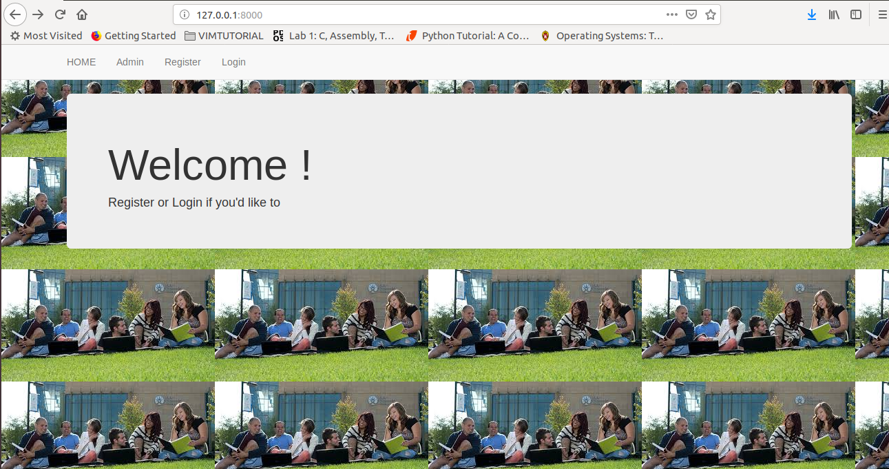
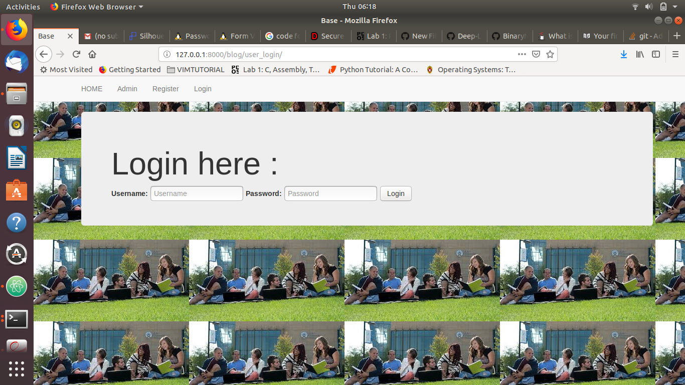
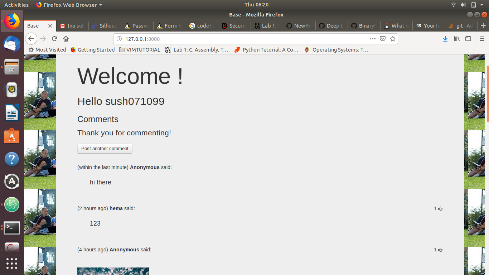

# Project Title

COLLEGE NETWORK:

College network is developed using django framework.

## Getting Started

College Connect is platform where everyone can share their pics or any other stuffs anonymously.
Either it’s a pdf file, images. We are on a mission to make people more open and share
their knowledge with everyone. Basically, This is currently for college students but can be used by
everyone on large scale when we are able to have a good server to run it.
1) Images,pdfs and many more to be implemented can be uploaded, shared and downloaded to
local storage.
2) Like, comment, delete (Only personal posts) and share functionality.
3) Anonymous posting.

### Prerequisites

Setup virtual environment using:python3 -m venv myvenv
Create a requirements.txt file and install django using pip install -r requirements.txt
Create a project using django-admin startproject mysite .

## Running the tests
To run tests use:python manage.py runserver

## Built With

Django framework,html,css,javascript

## Images

